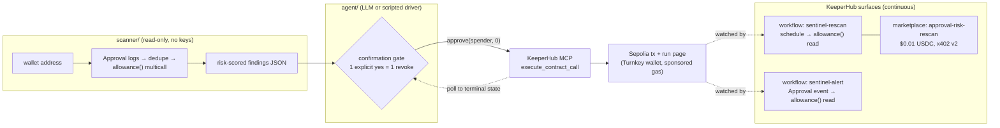

# ApprovalSentinel

An agent that finds dangerous ERC-20 approvals and revokes them onchain through KeeperHub — with a hard, code-enforced confirmation gate between the two.

Built for the **KeeperHub Agents Onchain** hackathon (DoraHacks). Everything claimed below is backed by a Sepolia transaction, a KeeperHub execution id, or a test you can run.

## The problem

Unlimited ERC-20 approvals are one of the largest sources of stolen funds onchain. Users sign `approve(spender, MAX_UINT256)` for a dapp, forget it, and years later an exploit of *any* approved contract drains the wallet — no new signature needed. The existing mitigations (revoke.cash-style dashboards) are manual: you have to remember to visit them, read raw addresses yourself, and click through a wallet popup per revoke. Nobody watches your approvals continuously, and nothing explains *why* a given approval is risky.

## The solution, in one sentence

ApprovalSentinel scans any wallet's live ERC-20 approvals, risk-scores and explains them, and (only after an explicit per-approval "yes") executes `approve(spender, 0)` through KeeperHub's MCP server, with KeeperHub workflows re-checking the exposure on a schedule and the scan published as a $0.01 x402 marketplace workflow.

## Architecture



Three independent units:

- **`scanner/`** — TypeScript + viem. Chunked `Approval` event log scan, dedupe to latest per (token, spender), `allowance()` multicall to keep only live approvals, heuristic risk score (unlimited allowance, unknown spender, approval age, owner's live balance). The practical default scans the latest 2,000,000 blocks; `--full-history` provides complete discovery when the RPC can sustain it. CLI with `--json` for agents. Zero keys, zero writes.
- **`agent/`** — revoke executor + harness. Builds `approve(spender, 0)` calldata with viem, submits via KeeperHub MCP `execute_contract_call`, polls `get_direct_execution_status` to a terminal state, then independently re-reads `allowance(owner, spender)` through an RPC before reporting success. The confirmation gate lives in code (`agent/src/harness.ts`), not in a prompt. Whichever brain drives the tools, Claude via the Agent SDK or the deterministic scripted driver, revoking without a fresh, explicit, per-approval "yes" is mechanically impossible. Only the literal answers `yes` / `y` open the gate; a closed stdin answers `quit`.
- **`workflows/`** — two KeeperHub workflows authored entirely through MCP `create_workflow` (schedule-triggered rescan, `Approval`-event-triggered alert), plus the marketplace listing of the rescan at $0.01 USDC per call with a live x402 v2 payment challenge. Dependency-free `node` scripts reproduce everything.

## Judging criteria map

| Criterion | How ApprovalSentinel meets it | Evidence |
| --- | --- | --- |
| **Executes onchain via KeeperHub** | Every revocation is a real `execute_contract_call` signed by the org's KeeperHub-managed Turnkey wallet, gas-sponsored. Revoke verified onchain afterwards (`allowance == 0` read via independent RPC). | Revoke tx [`0x1e4c…912f`](https://sepolia.etherscan.io/tx/0x1e4c1b81592ffbe70ba9be8c0d427e4f6ab3b511b03e2a6dad4381dd5698912f); end-to-end harness revoke tx [`0x42ba…f9a4c`](https://sepolia.etherscan.io/tx/0x42ba20119f8a039691cfe2a3f0e56f31a119e3c97faefa788c8be1632bdf9a4c) |
| **KeeperHub surface coverage** | MCP server (17 of the 31 tools exercised — direct execution, workflow CRUD, validation, marketplace; inventory in [`docs/mcp-tools.md`](docs/mcp-tools.md)); workflow builder (2 workflows created + validated via MCP, 1 executed); marketplace (listed at $0.01, live x402 v2 challenge); `kh` CLI (`kh doctor` in onboarding + starter template). | Workflow run [`qs6to8r9ul1w9h1p52swb`](https://app.keeperhub.com/executions/qs6to8r9ul1w9h1p52swb); listing slug `approval-risk-rescan`; [`docs/workflows.md`](docs/workflows.md) |
| **Reliability / observability** | Executor never trusts a synchronous `completed` — it polls to a terminal state, requires a transaction hash, and independently verifies the resulting allowance is zero. Idempotency keys on all writes (retry replays instead of double-spending). Failures surface the KeeperHub run link, never a fake success. 54 offline tests plus one live Sepolia integration test. | [`agent/src/revoke.ts`](agent/src/revoke.ts), [`docs/first-execution.md`](docs/first-execution.md), test table below |
| **Usefulness** | Point it at any wallet address — the scanner needs no keys and no account. The threat (forgotten unlimited approvals) is real and ongoing; the fix (allowance → 0) is universally safe. Scripted mode means the safety-critical path has zero LLM dependency. Use `--full-history` for complete discovery rather than the fast recent-window default. | `npx tsx scanner/src/cli.ts scan <your-address> --full-history` |

## Live evidence (Sepolia, all through KeeperHub)

Org wallet (allowance owner): `0xC7d92E2089BfD22539553FA8ea061cB094274dc5`. All gas sponsored. Full capture notes in [`docs/first-execution.md`](docs/first-execution.md).

| # | What | Execution id | Tx |
| --- | --- | --- | --- |
| 1 | Seed dirty approval: WETH `approve(0xdEaD, MaxUint256)` | `ib4rj0wp2g2asgz00nivd` | [`0x1033…93d4`](https://sepolia.etherscan.io/tx/0x10334ebfdef7b3f11e6c9787fb2ed7a4834345340e9586f28c51f6b2048d93d4) |
| 2 | Seed dirty approval: LINK `approve(0xdEaD, MaxUint256)` | `5zf57qaev0ifemqwhxrak` | [`0x41d5…f94b8`](https://sepolia.etherscan.io/tx/0x41d514652c69edfa03dd0dbbab4b9194558d18d15742274af9caa312bfcf94b8) |
| 3 | **Revocation**: WETH allowance → 0, then asserted `allowance == 0` onchain | `oex9nydnt9p32m55wh5wv` | [`0x1e4c…912f`](https://sepolia.etherscan.io/tx/0x1e4c1b81592ffbe70ba9be8c0d427e4f6ab3b511b03e2a6dad4381dd5698912f) |
| 4 | Harness smoke seed: WETH `approve(0x…beef, MaxUint256)` | `yy770wsaw9b3y9tfsdrlu` | [`0x6cf3…3991`](https://sepolia.etherscan.io/tx/0x6cf33f5037abc4d06d1ae5bd24cba7b7d074e260bdecd0c0e85ccd6abb403991) |
| 5 | **End-to-end harness revoke** (scan → confirm → revoke → verify) | [`i8q7efwybk9natj0eed8b`](https://app.keeperhub.com/executions/i8q7efwybk9natj0eed8b) | [`0x42ba…f9a4c`](https://sepolia.etherscan.io/tx/0x42ba20119f8a039691cfe2a3f0e56f31a119e3c97faefa788c8be1632bdf9a4c) |
| 6 | Workflow `sentinel-rescan` real execution (reads the live LINK exposure) | `qs6to8r9ul1w9h1p52swb` / run `wrun_01KXNFK1X9G51JJY0VY9SJRQ3Q` | onchain read: returned `2^256-1` |

The LINK → `0xdEaD` unlimited approval is **deliberately left live** so the demo (and you) can watch the agent find and revoke a real exposure. The scheduled workflow re-reads exactly that allowance.

Marketplace: `sentinel-rescan` is listed as [`approval-risk-rescan`](https://app.keeperhub.com/api/mcp/workflows/approval-risk-rescan/call) at $0.01 USDC per call; `call_workflow` returns a well-formed x402 v2 challenge (exact scheme, USDC on Base, `bazaar.discoverable: true`) — reproduced verbatim in [`docs/workflows.md`](docs/workflows.md).

## Honest limitations

- **LLM mode needs `ANTHROPIC_API_KEY`.** Without it the agent CLI automatically runs a deterministic scripted orchestrator — same tools, same code-enforced confirmation gate, no LLM. The proven end-to-end revoke (row 5 above) was run in scripted mode.
- **The notify leg of the workflows is Pro-gated.** On the free KeeperHub plan every notification/compute action (webhook, HTTP request, code, Discord/Telegram) returns `402 upgrade_required`. The created workflows therefore wire their real Schedule/Event triggers to a live onchain `allowance()` read instead. The full notify designs are preserved verbatim in `workflows/definitions/*-with-notify.json` and create cleanly on a Pro org with the identical MCP call.
- **The x402 self-pay hop needs real USDC on Base.** The creator side (list, price, live challenge) is complete and verifiable now; actually paying the $0.01 requires a funded Base wallet with an x402 signer (`@keeperhub/wallet` or agentcash). No testnet path exists for the payment leg.
- **Demo transactions are on Sepolia** (hackathon gas sponsorship covers testnets); the scanner and executor take `--chain mainnet` unchanged.
- **The default scan is intentionally bounded** to the latest 2,000,000 blocks (roughly nine months on mainnet) so public RPC evaluation finishes reliably. Use `--full-history` or an explicit `--from-block` for older approvals.
- `search_workflows` did not return our own listing at capture time (own-org exclusion or indexing lag); the x402 challenge is the proof the listing is live.

## Run it yourself

Prereqs: Node 20+, a KeeperHub API key in the repo root `.env` (`KH_API_KEY=kh_...`) for anything that executes. The scanner needs nothing.

```bash
# 1. Scan any wallet (read-only, no account, no keys)
cd scanner && npm install
npx tsx src/cli.ts scan 0xC7d92E2089BfD22539553FA8ea061cB094274dc5 --chain sepolia
# add --json for machine-readable findings; add --full-history for complete discovery

# 2. Agent: scan → explain → confirm → revoke via KeeperHub
cd ../agent && npm install
npx tsx src/cli.ts scan-and-fix 0xC7d92E2089BfD22539553FA8ea061cB094274dc5 --chain sepolia
# no ANTHROPIC_API_KEY → scripted mode (same gate); with it → Claude Agent SDK session

# 3. Workflows: reproduce creation/validation, or poke any MCP tool ad hoc
node workflows/scripts/create-workflows.mjs
node workflows/scripts/kh-mcp.mjs tools_documentation '{}'
```

Answer `yes` only for approvals you actually want revoked — the gate takes nothing else.

## Tests

| Package | Suite | Tests |
| --- | --- | --- |
| `scanner/` | `fetchApprovals` (chunked logs, dedupe, live-allowance filter), `riskScore` (table-driven), `cli` including full-history argument safety | **31** |
| `agent/` | `revoke` (calldata, polling, independent allowance verification, error paths), `harness` (gate semantics: explicit-yes only, one yes = one revoke, EOF = quit) | **23** |
| `agent/` | `revoke.integration` — live Sepolia revoke through KeeperHub, asserts `allowance == 0` onchain | **1** |

```bash
(cd scanner && npm test)
(cd agent && npm test)                  # unit only
(cd agent && npm run test:integration)  # spends a sponsored Sepolia tx
```

## Repo map

| Path | What |
| --- | --- |
| `scanner/` | Read-only approval scanner + risk scoring + CLI |
| `agent/` | Revoke executor, MCP client, confirmation-gated harness, CLI |
| `workflows/` | Workflow definitions (free-plan + Pro notify variants) and MCP scripts |
| `docs/` | MCP tool inventory, first-execution log, workflow/marketplace log, demo script, submission form |
| `bounty/` | Onboarding friction report (12 issues), starter template, prepared docs PR |

## Bounty package (Best Onboarding UX Improvement)

Everything under [`bounty/`](bounty/):

- [`bounty/REPORT.md`](bounty/REPORT.md) — 12 reproducible friction points from a real zero-to-first-transaction run, severity-ranked, each with reproduction, impact, and a suggested fix.
- [`bounty/starter-template/`](bounty/starter-template/) — `create-keeperhub-agent`: 5 minutes from nothing to a first KeeperHub-executed Sepolia transaction, ~40 lines of dependency-free Node.
- [`bounty/docs-pr/`](bounty/docs-pr/) — prepared upstream docs PR (troubleshooting guide, `.env.example`, CONTRIBUTING stub) referencing KeeperHub issue #1700.

## Roadmap

- Mainnet demo run (2–3 stale-approval revokes from a dedicated wallet, sponsored gas) during the build window.
- Notify leg live on a Pro org — definitions are ready, one `create_workflow` call each.
- Close the x402 self-pay loop with a funded Base signer, so the agent pays for its own scans.
- Spender reputation beyond the static allowlist (verified-contract age, proxy detection).
- Batch review UX: one summary, still one confirmation per revoke.
